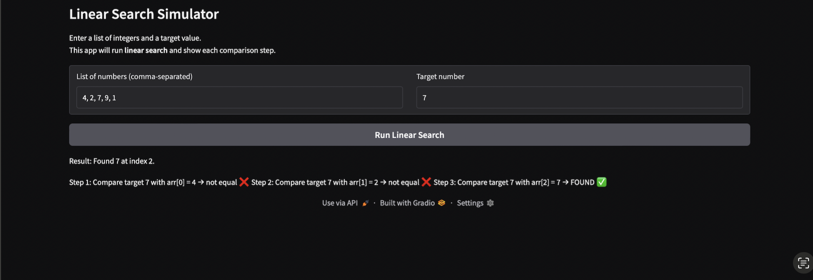

# Linear Search Simulator

This project is a simple Python app that demonstrates the **Linear Search** algorithm using a **Gradio** user interface.  
The user enters a list of integers and a target value, and the app shows each comparison step of the linear search.

---

## Demo Screenshot / GIF

## Problem Breakdown & Computational Thinking

### Why I chose Linear Search

I chose Linear Search because it is a simple and easy-to-understand searching algorithm. It checks each element in the list one by one until it finds the target value or reaches the end of the list. 

### Decomposition

- Take a list of numbers from the user as a comma-separated string
- Convert the string into a Python list of integers
- Take a target value from the user as a second input
- Loop through the list from left to right
- At each index, compare the current value with the target value
- If they are equal, return the index and stop the algorithm
- If the end of the list is reached with no match, return that the target was not found
- Display all of these comparison steps back to the user

### Pattern Recognition

- The same action is repeated for each element in the list:  
  compare → decide → move to the next index
- Only two things change each time: the current index and the current value
- This repeated structure is typical for many searching and looping algorithms

### Abstraction

- The app hides the low-level Python details (loops, indices, error handling) from the user
- The user only needs to think about:
  - “What list do I want to search?”
  - “What number am I looking for?”
- It does not matter how long the list is or what the specific numbers are; the same algorithm works in all cases

### Algorithm Design (Input → Processing → Output)

- Input
  - Textbox for the list of integers (comma-separated).
  - Textbox for the target integer value.
- Processing
  - Parse the input string into a list of integers.
  - Run the linear search algorithm, tracking each comparison step.
- Output
  - A markdown text block showing:
    - Whether the target was found or not
    - If found, the index where it appears
    - Each comparison step in order (Step 1, Step 2, etc.)